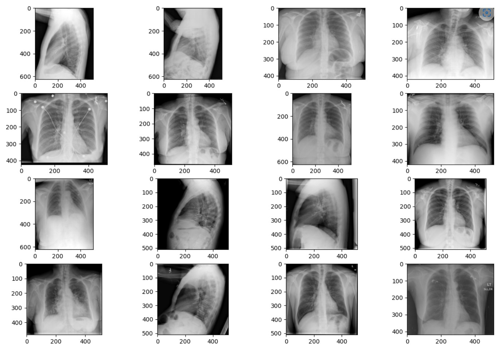
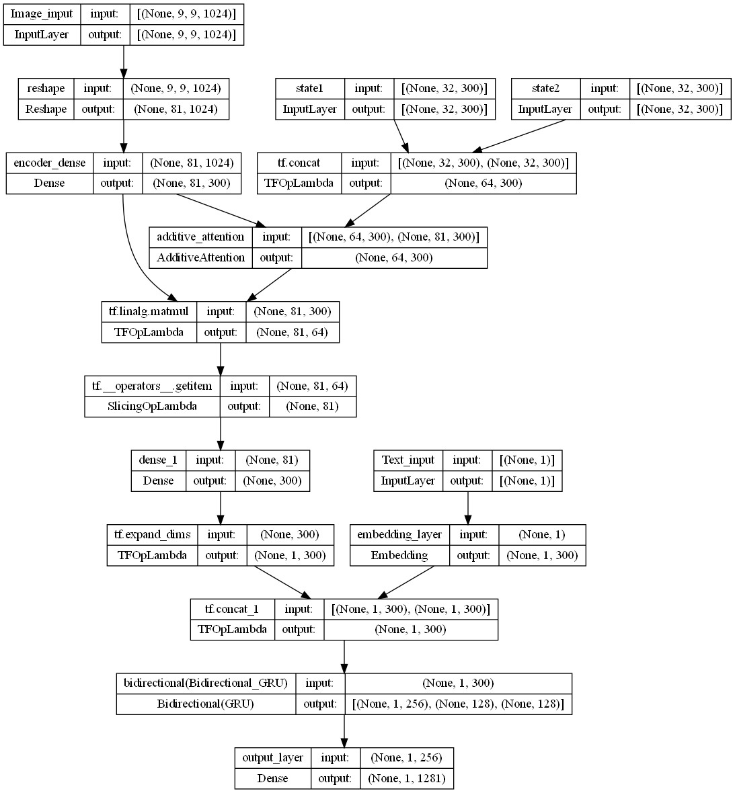
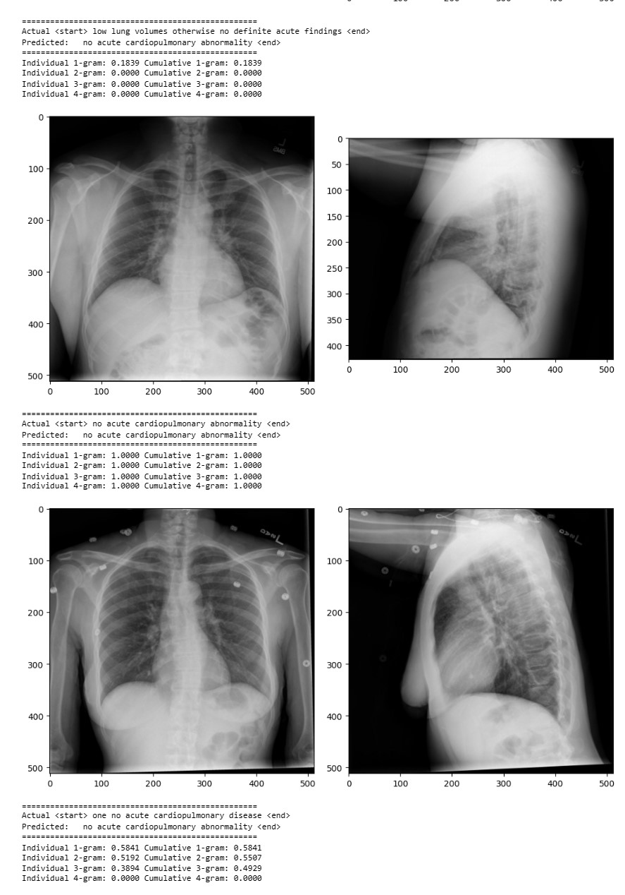

# Medical Diagnosis Prediction LSTM and Attention-Model

Abstract


Medical diagnosis prediction involves the use of deep learning techniques to automatically produce the diagnosis of the affected area of the patient. This process involves the extraction of relevant information from electronic health records (EHRs), natural language processing to understand and summarise the reports, and then gives diagnosis in a concise manner. The use of automatic generation of medical reports has the potential to improve efficiency, accuracy, and completeness of medical documentation, as well as reduce the burden on healthcare providers. It also has the potential to improve communication between healthcare providers and patients, and facilitate the sharing of information among healthcare providers. Also. in our model we are using encoder-decoder with attention mechanism. It focuses on the region of interest, reducing the computational power required to predict diagnosis


## Dependencies

-	pandas
-	numpy
-	tqdm
-	bs4
-	os
-	re
-	nltk
-	matplotlib
-	seaborn
-	wordcloud
-	cv2
-	sklearn
-	tensorflow
-	json
-	pickle
-	keras
-	PIL
-	io
-	datetime
-	gensim


## Requirements

All packages are listed in requirements.txt.

You can use 
```bash
$ pip install -r requirements.txt 
```
inside your virtual environment to install them all or do it manually.

To download the dataset to train the model, you need to download both of these datasets:

### X-rays-

```bash
http://academictorrents.com/details/5a3a439df24931f410fac269b87b050203d9467d
```
### Reports-

```bash
https://academictorrents.com/detail/66450ba52ba3f83fbf82ef9c91f2bde0e845aba9
```
    
## Attention Model

Attention networks are widely used in deep learning due to their ability to selectively focus on specific parts of the input that are relevant to the task at hand. In computer vision tasks, attention can be used to prioritize certain pixels over others, while in natural language processing tasks such as machine translation, attention can be used to prioritize certain words over others. A research paper can be consulted to learn more about attention mechanisms.


## Screenshots





## Acknowledgements

- https://www.appliedaicourse.com/
- https://jalammar.github.io/visualizing-neural-machine-translation-mechanics-of-seq2seq-models-with-attention/
- https://www.tensorflow.org/tutorials/text/image_captioning
- https://medium.com/analytics-vidhya/medical-report-generation-using-deep-learning-87b50096ead0
- https://udibhaskar.github.io/practical-ml/nlp/feature%20extraction/word2vec/fasttext/2020/03/16/Advanced-Feature-Extraction.html#FastText-Pretrained-Embeddings
- https://arxiv.org/abs/1502.03044
- https://arxiv.org/pdf/1603.08486.pdf
- https://www.analyticsvidhya.com/blog/2020/11/create-your-own-image-caption-generator-using-keras/

